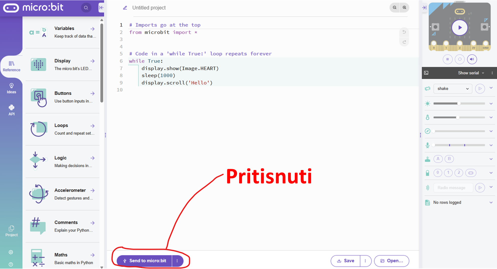
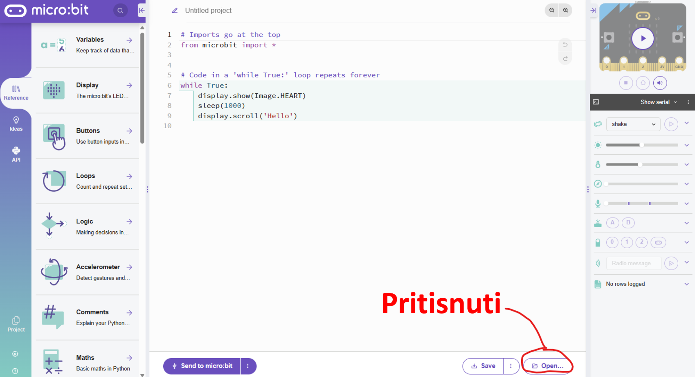
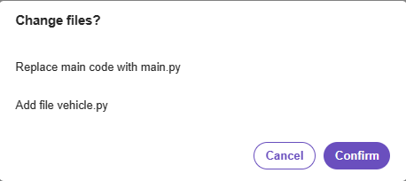

# Solderix API

Repozitorij sadrži programsku podršku i upute za SolderBIT projekte uključujuči autić i daljinski upravljač. Uz SolderBIT isto tako repozitorij sadrži micro:bit podršku za autić i daljinski upravljač bez hardvera.

# micro:bit

Kako bi se Solderix autić i daljinski upravljač osposobili na micro:bitu prvo je potrebno otići na [micro:bit Python Editor](https://python.microbit.org/v/3) web stranicu.

## micro:bit Daljinski Upravljač
Za daljinsku upravljač potrebno je prepisati programski kod iz repozitorija: ["Programski kod za daljinski upravljač"](microbit/controller/main.py). Nakon prepisivanja koda potrebno je spojiti micro:bit na računali i pritismuti tipku "Send to micro:bit" te pratiti njihove upute.
 

## micro:bit Autić
Za autić potrebno je skinuti i prebaciti programski kod unutar [ove mape](microbit/car) u [micro:bit Python Editor](https://python.microbit.org/v/3) pritiskom na tipku "Open". 

Pritiskom na "Open" otvara se pretraživać preko kojega je potrebno odabrati skinute skripte iz  [ove mape](microbit/car) u [micro:bit Python Editor](https://python.microbit.org/v/3) nakon čega je potrebno kliknuti "Confirm". Obratite pažnju da se main skripta koristi kao main.py, a vehicle.py se doda kao odvojena skripta isto kao što je prikazano na doljnoj slici.

Nakon prebacivanja koda potrebno je spojiti micro:bit na računali i pritismuti tipku "Send to micro:bit" te pratiti njihove upute.
 

# SolderBIT

Uz kit za autić i daljinski upravljač dolazi i mikroupravljač sličan micro:bit-u. Upravljač nudi korisnicima veću programsku memoriju i bolju konfiguraciju pinova, no za razliku od micro:bit-a potrebno je uložiti malo više vremena kako bi se radno okruženje za programiranje postavilo. 

## Instalacija Pythona
Pošto SolderBIT koristi Micropython kao svoj programski jezik, potrebno je omogućiti da račualo korišteno za programiranje podržava isti. Povezica za skidanje posljednje verzije Pythona nalazi se [ovdje](https://www.python.org/downloads/). Prilikom instalacije potrebno je kliknuti na kvačicu "Add Python to PATH" kako bi se Python mogao koristiti s bilo koje lokacije na računalu.

